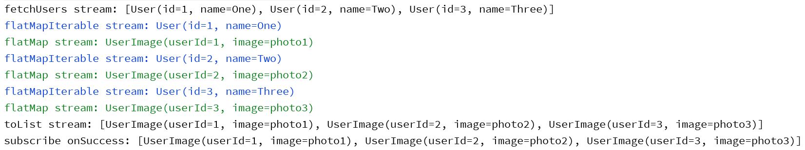

# about:
in the kotlin file [Runner.kt](../src/main/kotlin/Runner.kt)
i test the conjunction of the three rxjava operators:
`flatMapIterable` , `flatMap` , `toList`

# explain:

If you have a request that fetches a list of Users:
```kotlin
fun fetchUsers() : Observable<List<User>>
```

and you have another request that depend on the id of every User, so as to fetch another data -UserImage- like:
```kotlin
fun fetchUserImage(userId: Int) : Observable<UserImage>
```

and you want to combine these two requests and return a list of UserImage, then there are a three rxjava operators that used for that:

```kotlin
Api.fetchUsers()
   .flatMapIterable { users -> users }
   .flatMap { user -> Api.fetchUserImage(user.id) }
   .toList()
   .subscribe( { userImages -> println("$userImages") },
               { t -> println("t.localizedMessage) }
   )
```

the 1st one `flatMapIterable` will unroll/flatten the list of Users, meaning that it will send User by User.
<br />
the 2nd one `flatMap` will take the id from the User and do the secend request fetchUserImage so as to return the UserImage.
<br />
the 3rd one `toList` will collect all UserImages in a list so as to lastly return List<UserImage>.


# example:
the example here [Runner.kt](../src/main/kotlin/Runner.kt) prints what is going on in a colorized output:


```kotlin
    Api.fetchUsers()
        .doOnNext { users -> println("fetchUsers stream: $users") }

        .flatMapIterable{
                users -> users
        }
        .doOnNext { user -> println(AnsiColors.BLUE + "flatMapIterable stream: $user"  + AnsiColors.RESET ) }

        .flatMap {
                user -> Api.fetchUserImage(user.id)
        }
        .doOnNext { userImage -> println(AnsiColors.GREEN + "flatMap stream: $userImage"  + AnsiColors.RESET) }

        .toList()
        .doOnSuccess { userImages -> println("toList stream: $userImages") }

        .subscribe(
            { userImages -> println( "subscribe onSuccess: $userImages") },
            { throwable -> println("subscribe onError: " + throwable.localizedMessage) }
        )
```

when running it gives:



